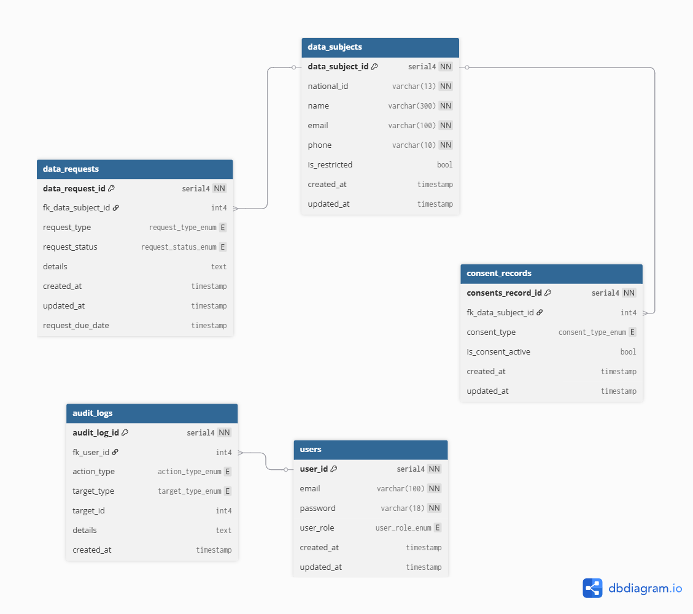

# Keranos's PDPA Management System ~ Assignment

## Author

[Poom Yimyuean (lebrancconvas)](https://github.com/lebrancconvas)

## Overview

Assignment Project for "Full-Stack Developer (Junior)" at "Keranos Tech Co., Ltd." (Bangkok, Thailand)

## URL (Development)

- Front-End URL: [https://keranos-pdpa.netlify.app/](https://keranos-pdpa.netlify.app/)
- Back-End (API) URL: [https://keranostech-assignment-pdpa.onrender.com/api](https://keranostech-assignment-pdpa.onrender.com/api)

## Project Setup (for Local Development)

### Requirement

- **PNPM**
- **Docker** (for using **Docker Compose** to open the database connection for local development.)

### Steps

You can do these steps from root directory of this project.
- run `pnpm install:all` for installing the whole project.
- run `pnpm run db:open` for opening the database connection for local development.
  - run `pnpm run db:close` for closing the database connection that you've opened.
- run `pnpm run dev` for running on local development mode for the entire project in both ***backend*** and ***frontend*** module.
  - or run `pnpm run dev:backend` for running only ***backend*** module.
  - or run `pnpm run dev:frontend` for running only ***frontend*** module.

## Tech Stack

### Programming Language

- TypeScript

### Front-End

- ReactJS (PNPM + Vite)

### Back-End

- ExpressJS (NodeJS + PNPM)

### Database

- PostgreSQL

### Database Manager

- DBeaver

### Containerization

- Docker (Docker Compose)

### Deployment

- Front-End: Netlify
- Back-End: Render
- Database: Render

## Software Design

### Database Schema & ER Diagram



Powered by [dbdiagram.io](dbdiagram.io)

The code below is the code that I use in dbdiagram.io for designing the ER diagram for this project.

```dbdiagram
// Enum Section

enum user_role_enum {
  ADMIN
  DPO
  USER
}

enum consent_type_enum {
  MARKETING
  SERVICE
  LEGAL
  CONTRACT
  ANALYTICS
}

enum request_type_enum {
  ACCESS
  RECTIFICATION
  ERASURE
  RESTRICT
  PORTABILITY
  INFORMED
  WITHDRAW
}

enum request_status_enum {
  PENDING
  PROGRESS
  COMPLETED
  REJECTED
}

enum action_type_enum {
  USER_REGISTRATION
  USER_LOGIN
  USER_LOGOUT
  DATA_SUBJECT_CREATE
  DATA_SUBJECT_READ
  DATA_SUBJECT_UPDATE
  DATA_SUBJECT_DELETE
  CONSENT_UPDATE
  REQUEST_CREATE
  REQUEST_READ
  REQUEST_UPDATE
  REQUEST_DELETE
}

enum target_type_enum {
  USER
  SUBJECT
  CONSENT
  REQUEST
}

// Table Design Section.

Table users {
  user_id serial4 [primary key, not null, unique]
  email varchar(100) [not null, unique]
  password varchar(18) [not null]
  user_role user_role_enum
  created_at timestamp [default: 'CURRENT_TIMESTAMP']
  updated_at timestamp [default: 'CURRENT_TIMESTAMP']
}

Table data_subjects {
  data_subject_id serial4 [primary key, not null, unique]
  national_id varchar(13) [not null, unique]
  name varchar(300) [not null]
  email varchar(100) [not null]
  phone varchar(10) [not null]
  is_restricted bool [default: false]
  created_at timestamp [default: 'CURRENT_TIMESTAMP']
  updated_at timestamp [default: 'CURRENT_TIMESTAMP']
}

Table consent_records {
  consents_record_id serial4 [primary key, not null, unique]
  fk_data_subject_id int4
  consent_type consent_type_enum
  is_consent_active bool [default: false]
  created_at timestamp [default: 'CURRENT_TIMESTAMP']
  updated_at timestamp [default: 'CURRENT_TIMESTAMP']
}

Table data_requests {
  data_request_id serial4 [primary key, not null, unique]
  fk_data_subject_id int4
  request_type request_type_enum 
  request_status request_status_enum [default: 'pending']
  details text
  created_at timestamp [default: 'CURRENT_TIMESTAMP']
  updated_at timestamp [default: 'CURRENT_TIMESTAMP']
  request_due_date timestamp
}

Table audit_logs {
  audit_log_id serial4 [primary key, not null, unique]
  fk_user_id int4
  action_type action_type_enum
  target_type target_type_enum
  target_id int4
  details text
  created_at timestamp [default: 'CURRENT_TIMESTAMP']
}

// Foreign Keys Reference Section.

ref: data_subjects.data_subject_id < consent_records.fk_data_subject_id
ref: users.user_id < audit_logs.fk_user_id
ref: data_subjects.data_subject_id < data_requests.fk_data_subject_id
```

## API Documentation

You can view Postman API Collections from here -> [PDPA_System_KeranosTech_Assignment.postman_collection.json](https://github.com/lebrancconvas/KeranosTech-PDPA-Assignment/blob/master/docs/api/PDPA_System_KeranosTech_Assignment.postman_collection.json)

### Users & User Authentication Routes

- **Authentication**
  - (POST) `/auth/register`
  - (POST) `/auth/login`
- **Users**
  - (GET) `/users`
  - (GET) `/me`

### Data Subjects Routes

- (POST) `/data_subjects`
- (GET) `/data_subjects`
- (GET) `/data_subjects/<data_subject_id>`
- (PUT) `/data_subjects/<data_subject_id>`
- (GET) `/data_subjects/<data_subject_id>/consents`
- (PUT) `/data_subjects/<data_subject_id>/consents`

### Data Requests Routes

- (POST) `/data_requests`
- (GET) `/data_requests`
- (GET) `/data_requests/<request_id>`
- (PUT) `/data_requests/<request_id>/status`

### Audit Logs

- (POST) `/audit_logs`
- (GET) `/audit_logs`

## Known Limitations & Future Improvements

### Known Limitations

- Understanding about the business domain.
- Understanding about authentication management.

### Future Improvement

- Finish other requirements (Data Requests, Dashboard, Report, Audit Logs, and Auth)
- User Interface Improvement (Responsive Design, Night Mode Toggle, Language support)
- Security concerned (Two Factor Authentication, Data Encryption, SQL Injection prevention)

## Assumptions

You can view my assumptions on this project via this file: -> [ASSUMPTIONS.md](https://github.com/lebrancconvas/KeranosTech-PDPA-Assignment/blob/master/docs/ASSUMPTIONS.md)